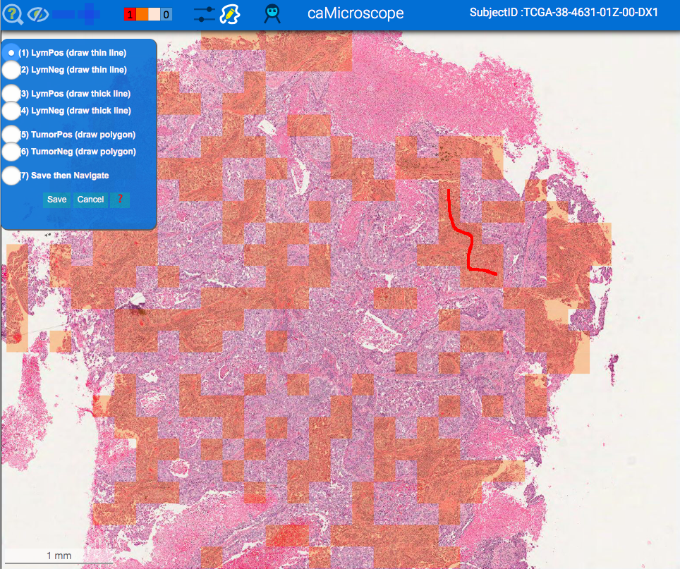
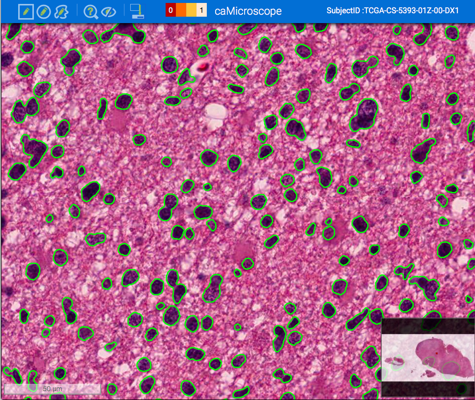
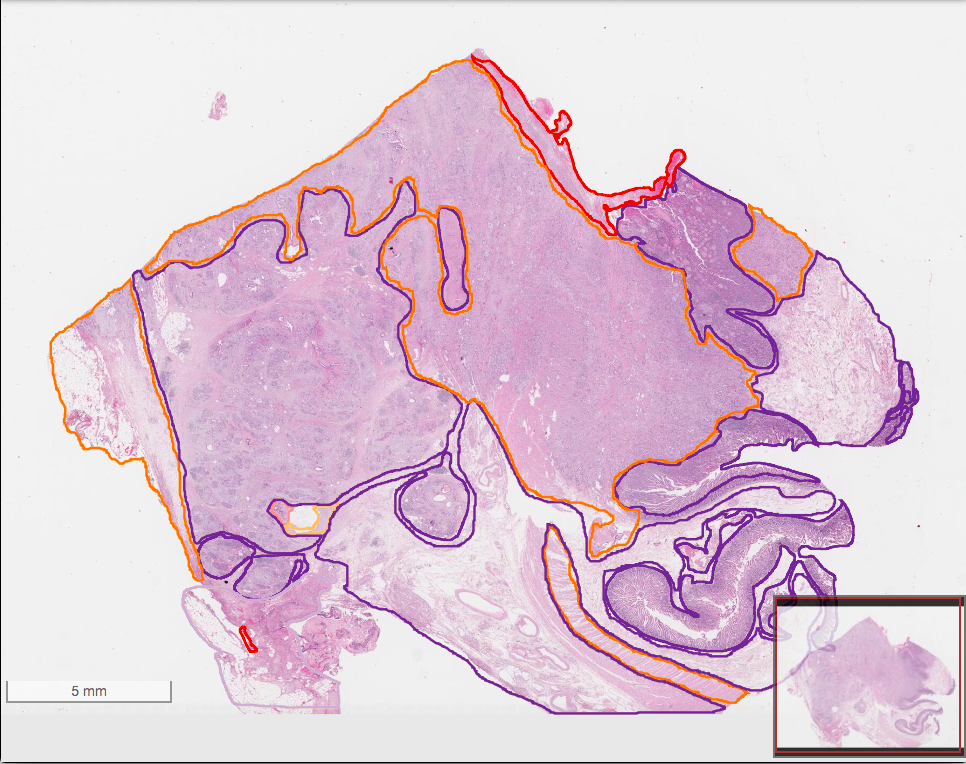
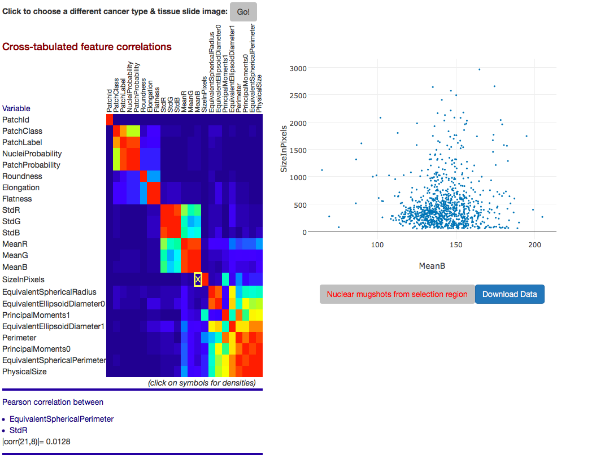

## Description

QuIP is a web accessible toolset designed to support analysis, management, and exploration of whole slide tissue images for cancer research. 

The QuIP system consists of a set of docker containers, which provide analysis execution and data management backend services, and web applications to load and visualize whole slide tissue images (in [OpenSlide](http://openslide.org) supported formats), run nuclear segmentation analyses on image tiles, and visualize and explore the analysis results. 

**The Application Service container** hosts several web applications to view whole slide tissue images, view and interact with analysis results, and edit and curate analysis results. caMicroscope, for example, facilitates the interactive exploration of whole slide tissue images and analysis results (overlaid on images as polygons or heatmaps). FeatureScape enables exploration of imaging features computed for segmented nuclei. It supports visualizations such as scatter plots to allow one to take a deep dive into nucleus-level features.

Viewing Classification Results | Viewing Segmentation Results
--------------------------|-------------
|
                          
                          
Curation of Imaging Features |Feature Exploration via FeatureScape
--------|-------------------
|

**The Analysis Service containers** manage the execution of image analyses on image tiles selected by the user using the application web interfaces. Currently the analysis service implements a level set based nuclear segmentation algorithm developed by our group. We are in the process of integrating a deep learning based pipeline for classification of tumor infiltrating lymphocytes (TILs) in whole slide tissue images. This integration will be released in a future version of QuIP. 

**The codes for the TIL classification pipeline are available at** https://github.com/SBU-BMI/u24_lymphocyte. Please see the Cell Reports paper for a description of the pipeline: 

Saltz, J., Gupta, R., Hou, L., Kurc, T., Singh, P., Nguyen, V., . . . Thorsson, V. Spatial Organization and Molecular Correlation of Tumor-Infiltrating Lymphocytes Using Deep Learning on Pathology Images. Cell Reports, 23(1), 181-193.e187. https://doi.org/10.1016/j.celrep.2018.03.086

**The Data Service containers** implement (1) the database for storing image metadata, analysis results, and metadata about analyses (e.g., analysis parameters). The database organizes analysis results using a GeoJSON compliant specification. Segmentation results are expressed as polygons and size, shape, intensity and texture features, such as area, mean intensity, for each segmented object as key-value pairs; (2) the functions for loading image metadata and image analysis results, which are output from the analysis service as image masks and csv files which contain the computed features and boundaries of segmented objects; and (3) the functions for querying feature results by the FeatureScape web application.  

## QuIP Video

This [video](https://www.youtube.com/watch?v=dK4c6ti1Dvc) shows the basic usage of the QuIP system.

## QuIP Demo VM

You may download a demo VMWare VM (in the OVA format) containing all of the docker images and web applications from the following [link](https://drive.google.com/file/d/0B9Sq9MWc46AuOHBZR0tGMTlXOU0/view?usp=sharing). The download size is 16GB. The VM was generated using VMWare Fusion 8.5.3 and may not be compatible with earlier versions of VMWare tools.  

The VM starts all the containers on boot. It is configured to use 2GB memory and 2 CPU cores. Please wait for about 30 seconds for the start process to complete. You can log on to the VM with userid: **quip** and password: **quipdemo**. The Google Chrome browser will open automatically upon login and will bring up the QuIP home page. A TCGA whole slide tissue image is already loaded to the system along with some analysis results. There are additional TCGA whole slide tissue images on /home/quip/Desktop which can be loaded using the Image Loader app accessible from the home page.

## Installing and Running QuIP 

### Requirements

1. [docker](https://www.docker.com) should be installed. You should be able to run docker commands (e.g., pull, run).
2. [git](https://git-scm.com) should be installed.
3. QuIP requires access to a folder (data folder) on the host machine to store whole slide tissue images 
   and the database. You should have read and write permissions to the folder.
4. The installation scripts and the QuIP software have been tested on Linux systems and with the Google Chrome 
   browser. 
5. The following three ports should be open to be able to use the web applications: 80, 6002, 3000. 
   
### Cloning the distribution repository

Clone this repository.

    git clone https://github.com/SBU-BMI/quip_distro
         
### Running the containers

Before pulling and running the containers, create a data folder if it does not exist. The data folder will be used to 
store images and the database as well as configuration files required by the containers. Note you should have read and write 
permissions to the folder.

Execute the build_containers_release.sh script. At the command prompt:

    cd <path to your github repositories folder>
    <path to quip_distro folder>/build/build_containers_release.sh
    
Execute the run_containers_release.sh script. At the command prompt:
    
    cd <path to quip_distro folder>
    ./run_containers_release.sh <full path of data folder>

The startup process will create an "img" sub-folder in the data folder where tissue images will be stored and 
a "data" sub-folder where the database files will be stored. Please make sure the storage folder has enough 
space for images and the database. 

The startup process will pull the QuIP containers from their respective docker image repositories, create a user-defined 
docker network (quip_nw), start up the containers and attach them to the user-defined docker network. 

After the containers are started, you may access the QuIP web applications using a browser at `http://<hostname>`. Here, hostname is the name or IP address of the host machine where the containers are running. 

### Configuring authentication

Check the [security documentation](https://github.com/camicroscope/Security/blob/release/README.md) for enabling/disabling authentication

